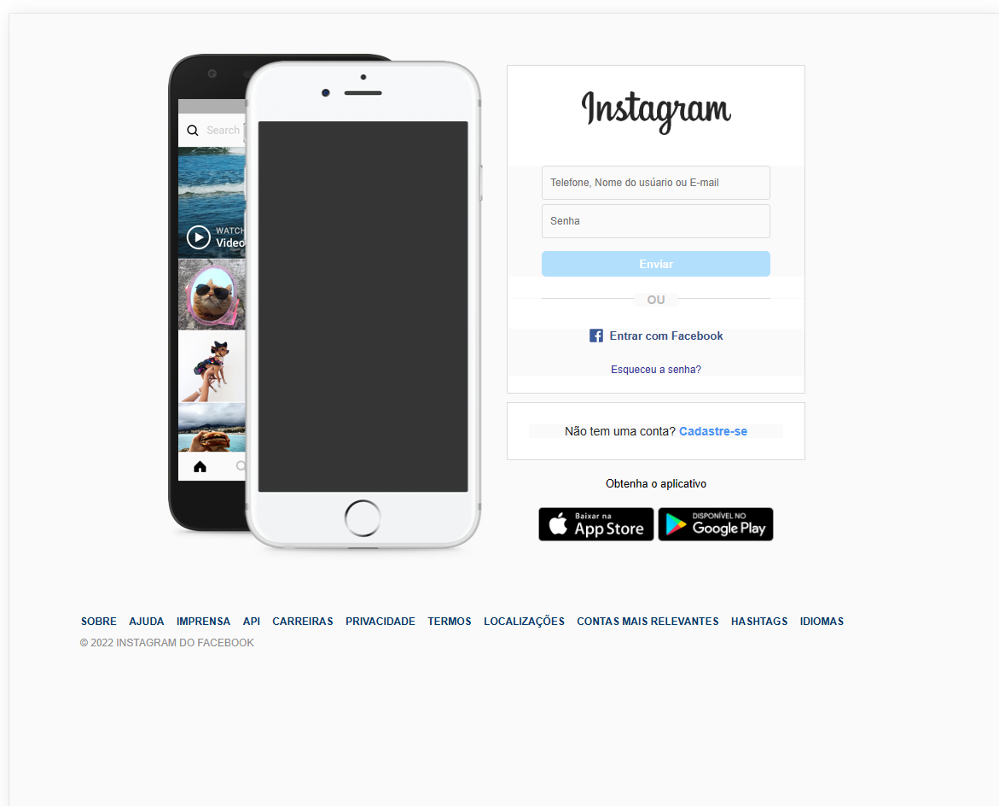

# Home Page Instagram

> Técnicas de flexbox em CSS

> Tags semanticas em HTML

> Media Query para Smartphone e Tablet

<h2 align="center" style="margin-bottom:20px">Projeto:</h2>

    

<h2 align="center" style="margin-bottom:20px">Responsivo:</h2>

    

